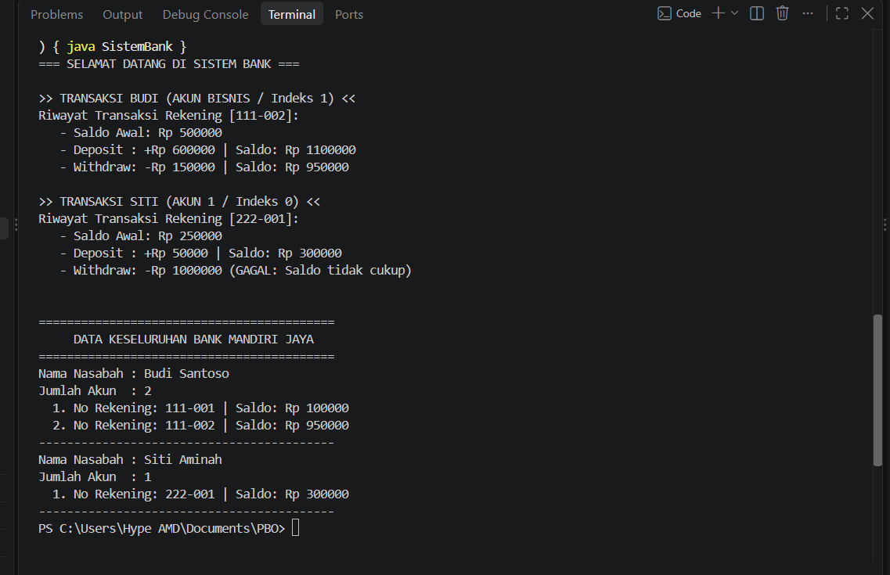

# Tugas Arraylist PBO - Sistem Pengelolaan Bank

Repositori ini berisi program simulasi pengelolaan bank sederhana berbasis **Java** menggunakan konsep *Object-Oriented Programming* (OOP) dan `ArrayList`.

---

## 📌 Deskripsi Program
Program ini mensimulasikan sistem perbankan dengan struktur relasi objek bertingkat:
- **Bank**: Mengelola daftar banyak nasabah (`ArrayList<Nasabah>`).
- **Nasabah**: Mengelola data nasabah serta daftar rekening/akun yang dimiliki (`ArrayList<Akun>`).
- **Akun**: Mengelola nomor rekening, saldo, transaksi deposit, withdraw, serta mencatat riwayat transaksi.

---

## 🛠️ Library yang Digunakan
Program ini hanya menggunakan library standar bawaan Java (*built-in*):
- `java.util.ArrayList`: Digunakan untuk menyimpan kumpulan data dinamis (daftar nasabah di kelas `Bank`, daftar akun di kelas `Nasabah`, dan daftar riwayat transaksi di kelas `Akun`).

---

## 📸 Screenshot Output Program

